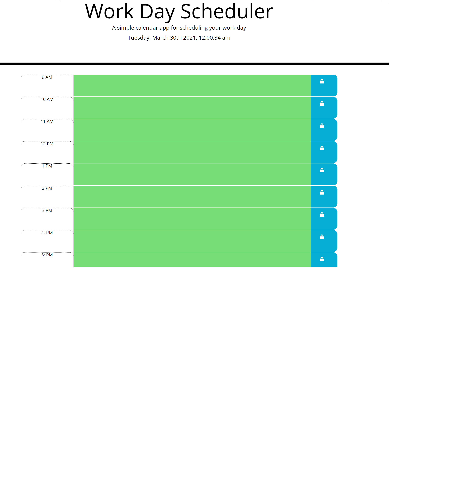
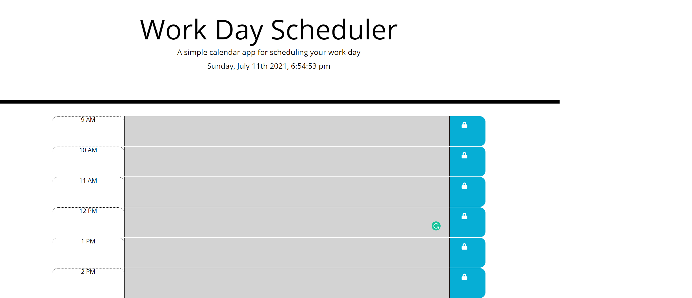

 
# Day Planner

## Project Description 
The Day Planner is a  simple calendar application that allows a user to save events for each hour of the day. The app auto tracks time and has color indicators to help the user know the upcoming deadlines. 

## Table of Content

* [Installation](#installation)

* [Usage](#usage)

* [License](#License)

* [Contribution](#Contribution)

* [Credit](#Credits)

* [Test](#Test)

* [Question](#Question) 

## Installation
No steps to install

Below is the URL to the webpage and github repository. 

Website URL: https://synag.github.io/day_planner/

Github repository: https://github.com/synag/day_planner

## Usage
Limited usage instructions. 

The sreenshot for the Weekday scheduler is below. 

## License
The license used for this project is MIT. Here is the license link https://opensource.org/licenses/MIT

## Credits
html, js, css, local storage

## Contribution
No contribution guidelines

## Test
No test instructions

## Questions
Please contact me with any questions.  

* Github username: synag
* Github URL: https://github.com/synag
* Email:  cbenbow@synergisticagility.com 