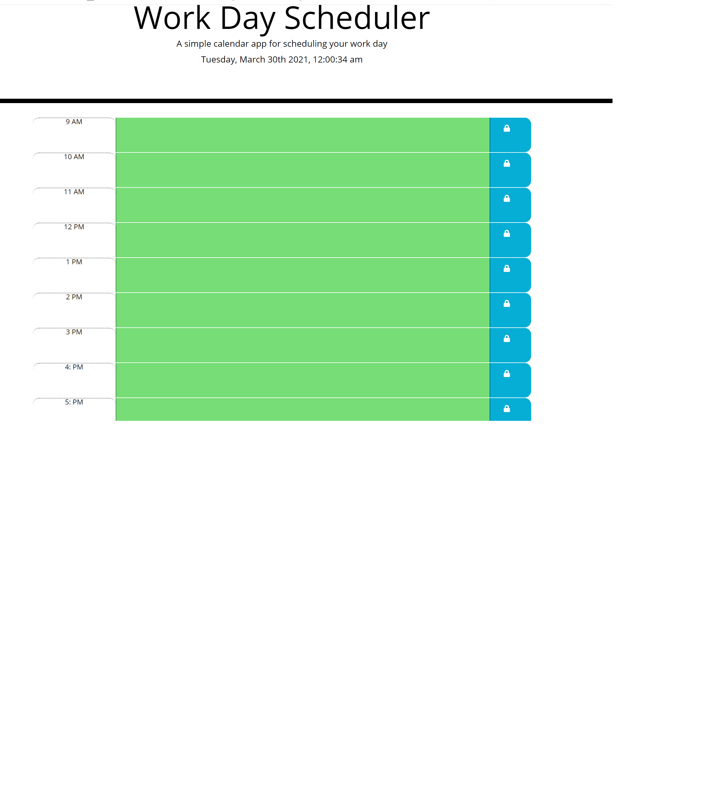

# 05 Third-Party APIs: Work Day Scheduler

## Your Task

Create a simple calendar application that allows a user to save events for each hour of the day by modifying starter code. This app will run in the browser and feature dynamically updated HTML and CSS powered by jQuery.

## Installation

There are no specific installation instructions. However, the coding_quiz Application is hosted on Github. Below is the URL to the webpage. 

URL: 

Github repository: 

Folders and Files
- ReadMe: weekly planner Instructions
- Index.html: wweb page
- Asset Folder (CSS folder and js folder)


## Usage and Demo 

Minimum usage requirements. 

Below is the weekly planner screenshot, the image shows the web application's appearance and functionality:




## Credits

No additional developers worked on this project. However, I did use the following tools and resources. 

Tools: HTML, CSS javaScript

I also used the w3school (https://www.w3schools.com/)  as a resources.


## License

Exclusive rights to the source are granted to Carl Benbnow as the developer and owner of the Password Generator site.


## User Story

```md
AS AN employee with a busy schedule
I WANT to add important events to a daily planner
SO THAT I can manage my time effectively
```

## Acceptance Criteria

```md
GIVEN I am using a daily planner to create a schedule
WHEN I open the planner
THEN the current day is displayed at the top of the calendar
WHEN I scroll down
THEN I am presented with timeblocks for standard business hours
WHEN I view the timeblocks for that day
THEN each timeblock is color coded to indicate whether it is in the past, present, or future
WHEN I click into a timeblock
THEN I can enter an event
WHEN I click the save button for that timeblock
THEN the text for that event is saved in local storage
WHEN I refresh the page
THEN the saved events persist
```


## Grading Requirements

This homework is graded based on the following criteria: 

### Technical Acceptance Criteria: 40%

* Satisfies all of the above acceptance criteria plus the following:

  * Uses a date utility library to work with date and time

### Deployment: 32%

* Application deployed at live URL

* Application loads with no errors

* Application GitHub URL submitted

* GitHub repo contains application code

### Application Quality: 15%

* Application user experience is intuitive and easy to navigate

* Application user interface style is clean and polished

* Application resembles the mock-up functionality provided in the homework instructions

### Repository Quality: 13%

* Repository has a unique name

* Repository follows best practices for file structure and naming conventions

* Repository follows best practices for class/id naming conventions, indentation, quality comments, etc.

* Repository contains multiple descriptive commit messages

* Repository contains quality README file with description, screenshot, and link to deployed application


- - -

